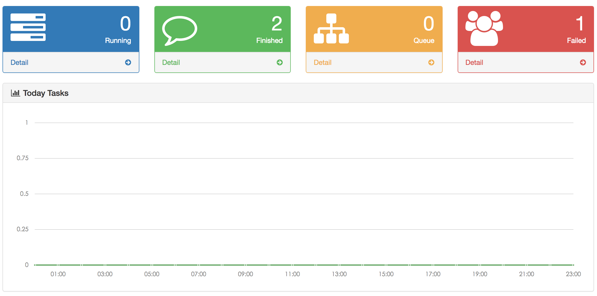

# Dashboard

We enter ```http://host:port/hc``` through the browser, access to the Hive Cube Dashboard page. The page contains the following:
  * Running Tasks
  * Finished Tasks
  * Queue Tasks
  * Failed Tasks
  * Today Task Charts
  * Lastest 10 Tasks

As shown in the following figure:


