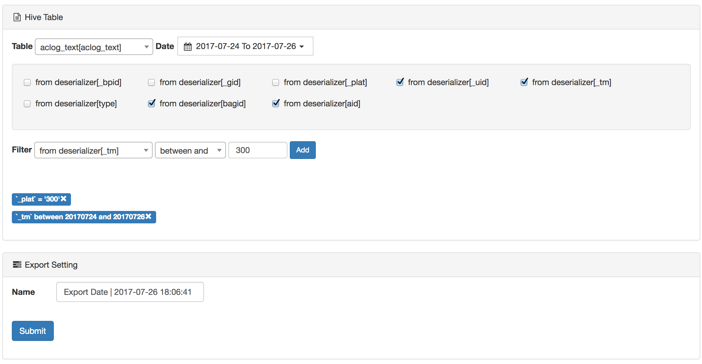

# Hive
The Hive module can use generic export and custom SQL export tasks in which generic exports submit tasks by selecting each table field and filtering the conditions. Custom SQL export is to write business SQL in the edit area for task submission.

## Common
Select the field of the hive data warehouse table for data export. As shown in the following figure:

## Custom
Write SQL and submit in the edit area. As shown in the following figure:

