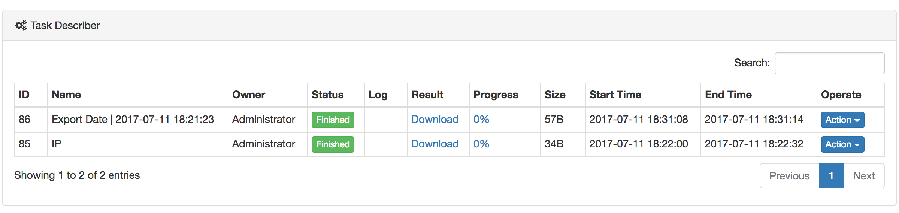

# Tasks
The task module demonstrates all the tasks that are submitted from the hive module, including individual tasks, all tasks, automatic tasks, and all automatic tasks. As shown in the following figure:

