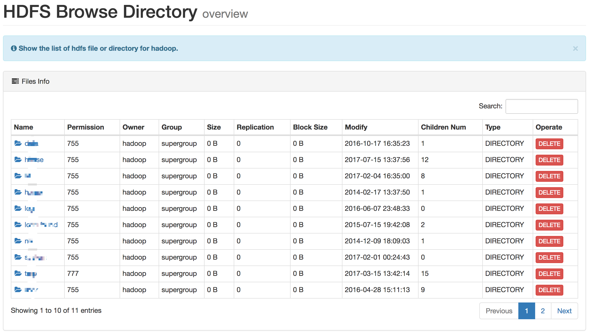
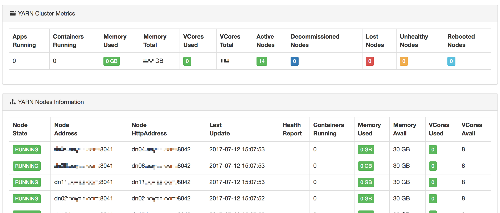
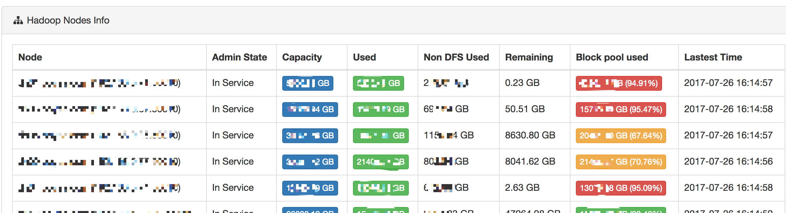
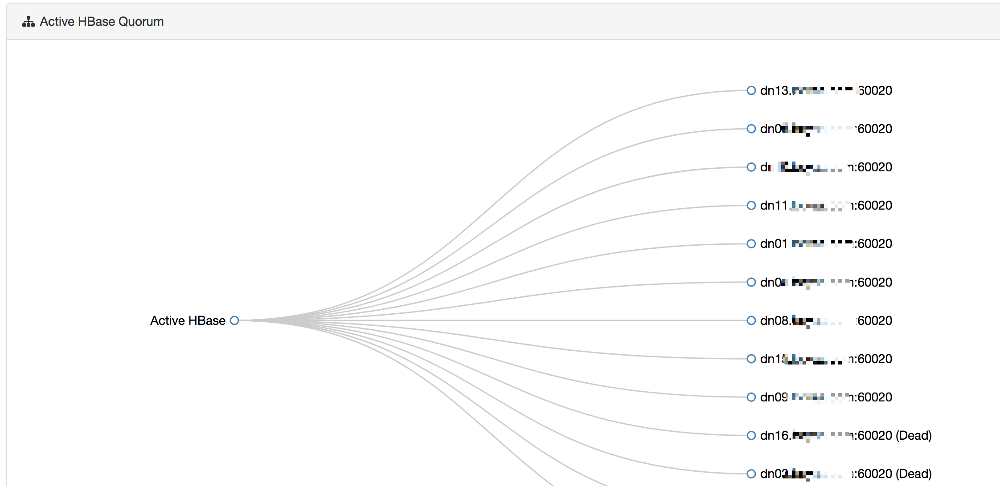

# Metrics

The monitoring module can monitor, manage ```HDFS```, ```YARN``` resource usage, ```Hadoop``` cluster health status, and ```HBase``` node survival status and so on.

## HDFS


## YARN



## Hadoop



## HBase


