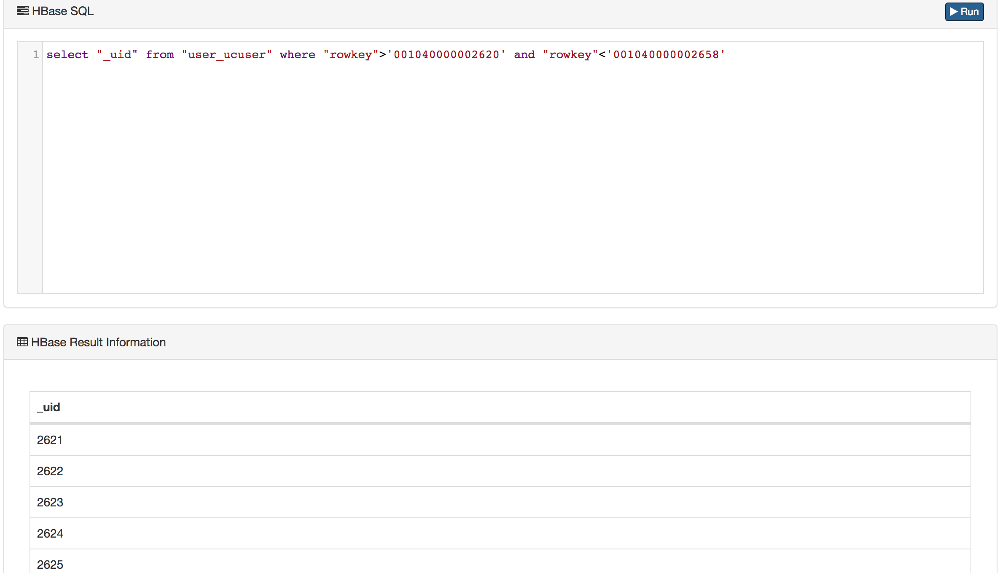

# Storage

The storage media module currently contains query operations for ```MySQL``` and ```HBase```.

## HBase
To use the SQL query function of ```HBase```, you need to configure the schema of the corresponding ```HBase``` table in the ```HBase``` column under the ```Config``` module. As shown in the following figure:


