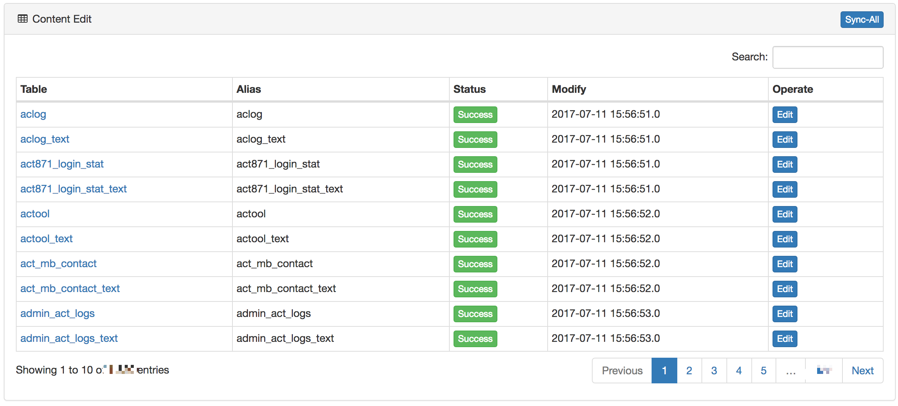
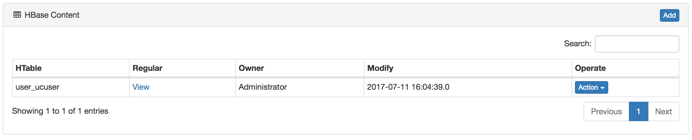

# Config
Users configure the schema of the HBase table, as well as synchronize the hive table structure and modify the hive table alias and field alias.

## Hive
Administrators can edit the Hive table structure in the admin interface, modify the field notes and other operations. As shown in the following figure:



## HBase
Configure the table structure of ```HBase``` for querying ```HBase``` table data using SQL. As shown in the following figure:


