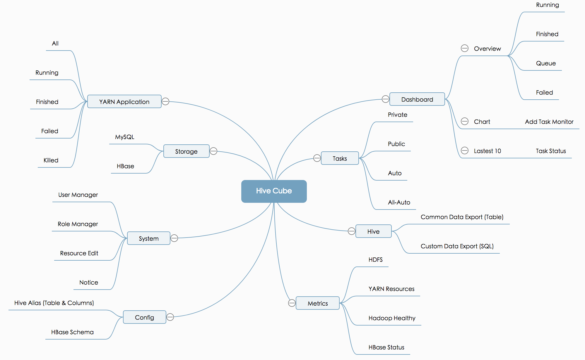

# Architecture
The system consists of task management (submission, modification, deletion, etc.), task monitoring, cluster resource monitoring, storage media query, system rights management, metadata alias and Schema management, as shown below:

